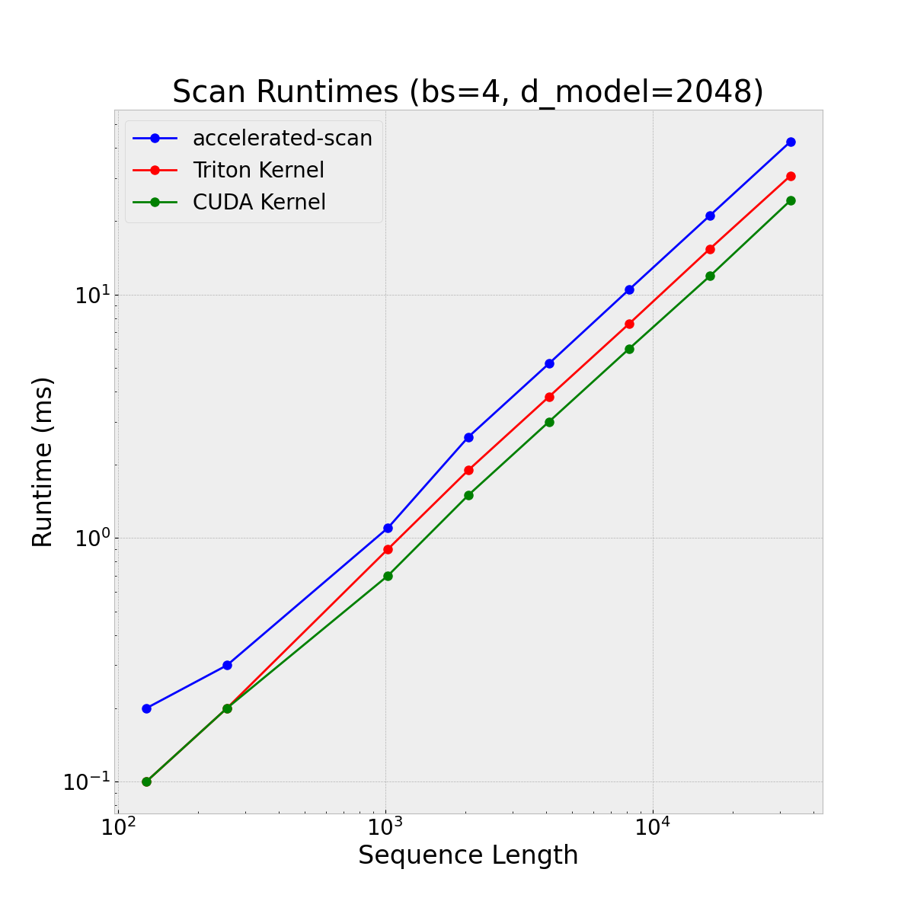

# Sequential Scan

This repo contains two implementations of a sequential/linear scan. The scan we compute a recurrence of the form: $h_{t+1} = a_{t+1}\odot h_t + b_{t+1}$ where $h_t,a_t,b_t \in \mathbb{R}^n$. The motivation for this code stems from `Griffin: Mixing Gated Linear Recurrences with Local Attention for Efficient Language Models` which proposes a (diagonal) RNN with gated linear recurrences, Hawk. On TPU, the authors note that the tree-based parallal associcative scan actually obtains a slower runtime than a sequential/linear scan. On GPU, [the same results seem to hold](https://twitter.com/SonglinYang4/status/1763598848130453728).

# Installation

The following dependencies should be satisfied to install:

- PyTorch >= 2.2.0
- Triton >= 2.2.0

If running tests, the following additional dependencies are required:
- NumPy >= 1.26
- PyTest >= 8.0.0

In addition to this, a working copy of [nvcc](https://docs.nvidia.com/cuda/cuda-compiler-driver-nvcc/index.html) is required, all code was developed with nvcc 12.0. If on VSCODE, using a
[Dev Container](https://code.visualstudio.com/docs/devcontainers/create-dev-container) to get access to the correct version of NVCC is recommended:


```bash 
cat .devcontainer.json 
{
    "name": "CUDA",
    "image": "nvidia/cuda:12.0.0-devel-ubuntu22.04",
    "runArgs": [
      "--gpus",
      "all"
    ]
}
```

To install: 
```
git clone https://github.com/fattorib/sequential_scan.git
pip install .
```

# Kernels

There are two sets of kernels available here:

```sequential_scan.scan_tr```: 
These are the basic Triton kernels which implement the forward and backward passes of the scan. They were designed with simplicity and readability in mind, while still providing decent performance. 

```sequential_scan.scan_cu```: These are the higher performing kernels written in CUDA. They implement double-buffering at a register level to attain higher throughput (25% faster than Triton kernels) and use manual `__nv_bfloat162` instructions and vectorized loads. Due to the manual work required to get all of these components to work, the kernels themselves are longer and (probably) harder to read. In my tests, the main performance speedups here come from the double buffering, this is an optimization the Triton compiler does not perform, removing double buffering leads to CUDA kernels that peform around 10% slower than their Triton equivalents.


# Use

Basic use:
```python
import torch
from sequential_scan import scan_cu, scan_tr

bs, sq, d_model = 2, 1024, 768
alpha = torch.randn(
    (bs, sq, d_model), device="cuda:0", dtype=torch.bfloat16, requires_grad=True
)
beta = torch.randn(
    (bs, sq, d_model), device="cuda:0", dtype=torch.bfloat16, requires_grad=True
)

out_cu = scan_cu(alpha, beta)
out_tr = scan_tr(alpha, beta)

print(out_cu)
print(out_tr)
```

# Tests

Run `pytest sequential_scan` from the base of the directory where the repo was cloned to run all tests.

# Benchmarks

Forward + Backward runtimes, `accelerated-scan` is included as it includes a high-performance implementation of a first-order parallel associative scan.

Note that the kernels contained in this repo are more flexble and memory efficient -- we don't require sequence lengths that are powers of two, unlike `accelerated-scan`.

<p align="center">



</p>

To run the benchmarks, you can use the provided CLI under `benchmark.py`. To benchmark the three methods with a batch size of 8 and model dimension of 1024, run:

```bash
python3 benchmark.py --d_model 1024 --bs 8 --plot_name 'output_fwd_bwd'
```

If you want to only benchmark the forward pass, run:
```bash
python3 benchmark.py --d_model 1024 --bs 8 --plot_name 'output_fwd' --fwd_only
```


# Citations

```bibtex
@misc{Kyrylov2024-pr,
  title     = "Proger/accelerated-scan: 0.1.2 --- reverse reference scan",
  author    = "Kyrylov, Volodymyr",
  abstract  = "This release includes reverse=True flag on
               accelerated\_scan.ref.scan. Full Changelog:
               https://github.com/proger/accelerated-scan/compare/0.1.1...0.1.2",
  publisher = "Zenodo",
  year      =  2024
}


```

```bibtex
@misc{de2024griffin,
      title={Griffin: Mixing Gated Linear Recurrences with Local Attention for Efficient Language Models}, 
      author={Soham De and Samuel L. Smith and Anushan Fernando and Aleksandar Botev and George Cristian-Muraru and Albert Gu and Ruba Haroun and Leonard Berrada and Yutian Chen and Srivatsan Srinivasan and Guillaume Desjardins and Arnaud Doucet and David Budden and Yee Whye Teh and Razvan Pascanu and Nando De Freitas and Caglar Gulcehre},
      year={2024},
      eprint={2402.19427},
      archivePrefix={arXiv},
      primaryClass={cs.LG}
}
```